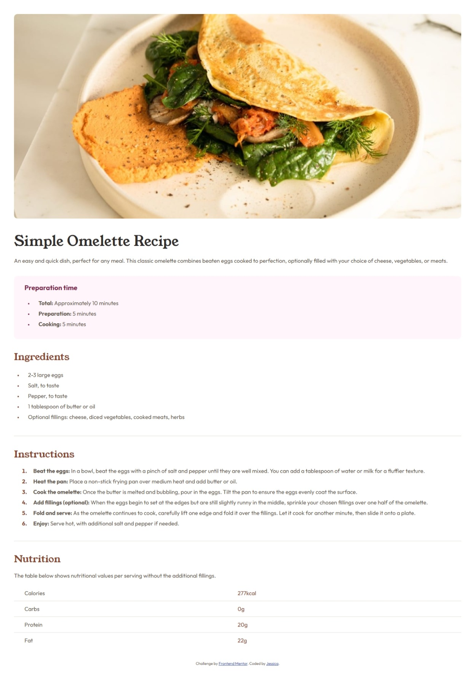

# Frontend Mentor - Recipe page solution

This is a solution to the [Recipe page challenge on Frontend Mentor](https://www.frontendmentor.io/challenges/recipe-page-KiTsR8QQKm). Frontend Mentor challenges help you improve your coding skills by building realistic projects. 

## Table of contents

- [Overview](#overview)
  - [Screenshot](#screenshot)
  - [Links](#links)
- [My process](#my-process)
  - [Built with](#built-with)
  - [What I learned](#what-i-learned)
  - [Continued development](#continued-development)
  - [Useful resources](#useful-resources)
- [Author](#author)


## Overview

### Screenshot



### Links

- Solution URL: [Repository code](https://github.com/JesNetWD/Frontend-Mentor-Recipe-page-Challenge)
- Live Site URL: [Visit live site here]( https://jesnetwd.github.io/Frontend-Mentor-Recipe-page-Challenge/)

## My process

### Built with

- Semantic HTML5 markup
- CSS custom properties
- Flexbox

### What I learned

I learnt how to change the color of the marker of list items. it was the first i had come across such a thing. 
I also learnt how to use the @font-face property for fonts that are not installed on my system. 
I had learnt it before but it was my first time applying it.
I also used flexbox in the nutrition section of my code it took me a while before i was able to fiigure out how to do it properly.

To see how you can add code snippets, see below:

```html
<header>
      

      <div>
        <h1 id="title" class="font">Simple Omelette Recipe</h1>

        <p>
          An easy and quick dish, perfect for any meal. This classic omelette
          combines beaten eggs cooked to perfection, optionally filled with your
          choice of cheese, vegetables, or meats.
        </p>
      </div>
    </header>

    <main>
      <div id="prep">
        <h2>Preparation time</h2>
        <ul>
          <li><span class="bold">Total:</span> Approximately 10 minutes</li>
          <li><span class="bold">Preparation:</span> 5 minutes</li>
          <li><span class="bold">Cooking:</span> 5 minutes</li>
        </ul>
      </div>

      <div class="divider">
        <h2 class="font brown">Ingredients</h2>
        <ul id="marker">
          <li>2-3 large eggs</li>
          <li>Salt, to taste</li>
          <li>Pepper, to taste</li>
          <li>1 tablespoon of butter or oil</li>
          <li>
            Optional fillings: cheese, diced vegetables, cooked meats, herbs
          </li>
        </ul>
      </div>
```
```css
@font-face {
  font-family: "Outfit Thin";
  src: url("./Outfit-VariableFont_wght.ttf") format("ttf");
}
@font-face {
  font-family: "Young Serif";
  src: url("./YoungSerif-Regular.ttf");
}

#marker li::marker {
  color: #854632;
  font-size: smaller;
}

#prep li::marker {
  color: #7b284f;
  font-size: smaller;
}

#numeral li::marker {
  color: #854632;
  font-weight: 700;
}

.label {
  display: flex;
  justify-content: space-between;
  width: 100%;
  margin: 0;
  padding: 10px 30px;
}

.label-no {
  width: 50%;
}
```

### Continued development

I think i will like to focus a bit more on writing cleaner code. I felt my code was a little disorganized especially the code for styling the layout. I would like to improve on layout and flexbox.

### Useful resources

- [CSS Layout - Horizontal & Vertical Align](https://www.w3schools.com/css/css_align.asp) - This helped me vertically align the text in the last section and gave some insights about horizontal alignment as well.

## Author

- LinkedIn - [Jessica Nwoye](www.linkedin.com/in/jessica-nwoye-45330b311)
- Frontend Mentor - [@JesNetWD](https://www.frontendmentor.io/profile/JesNetWD)
